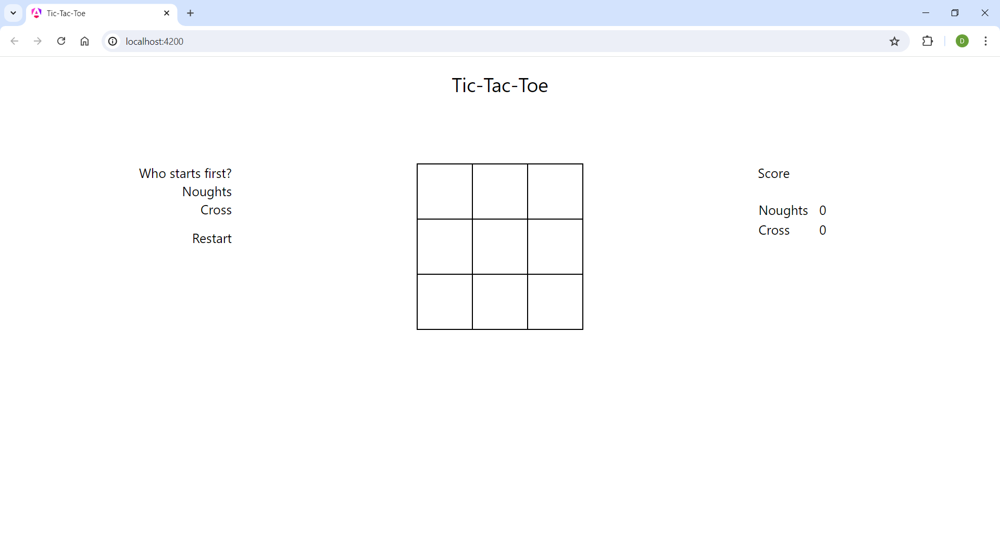
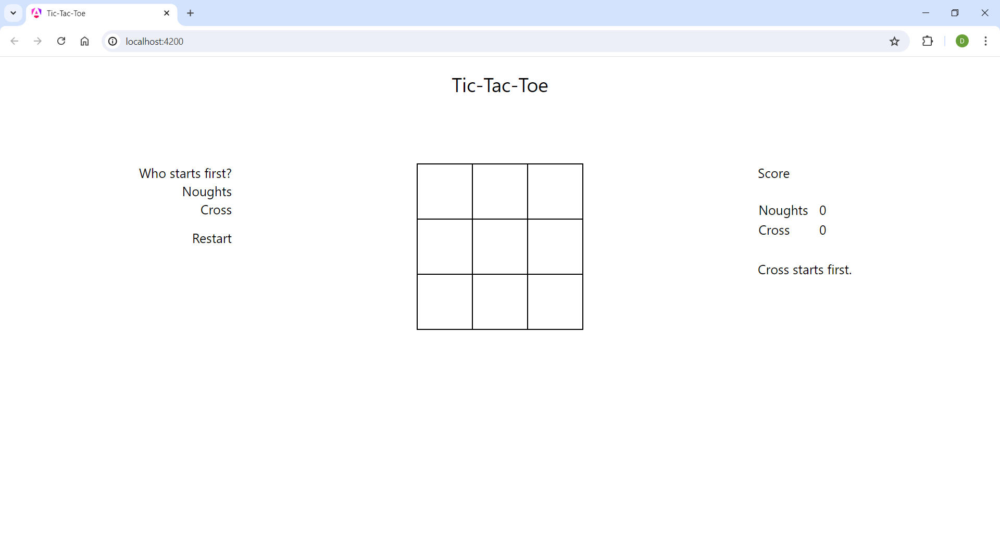
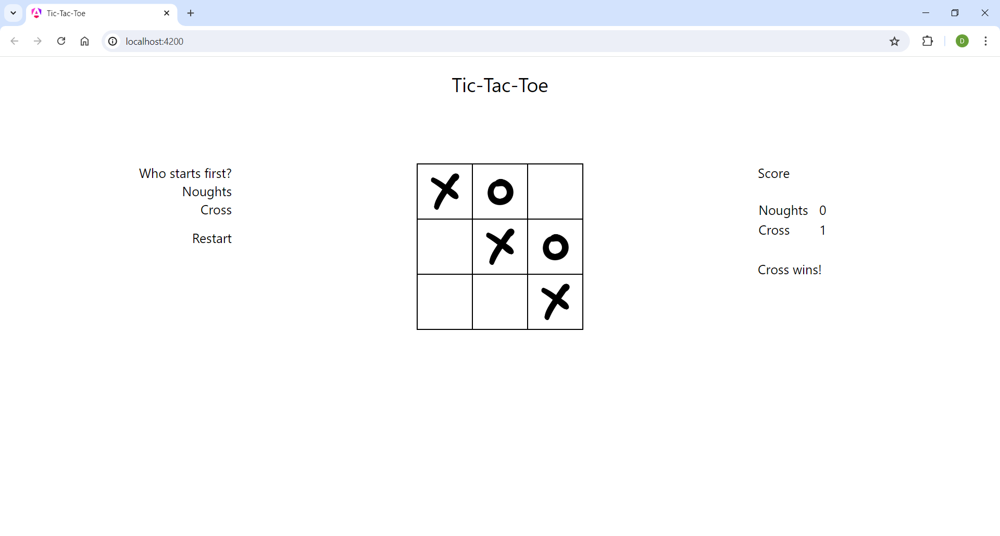
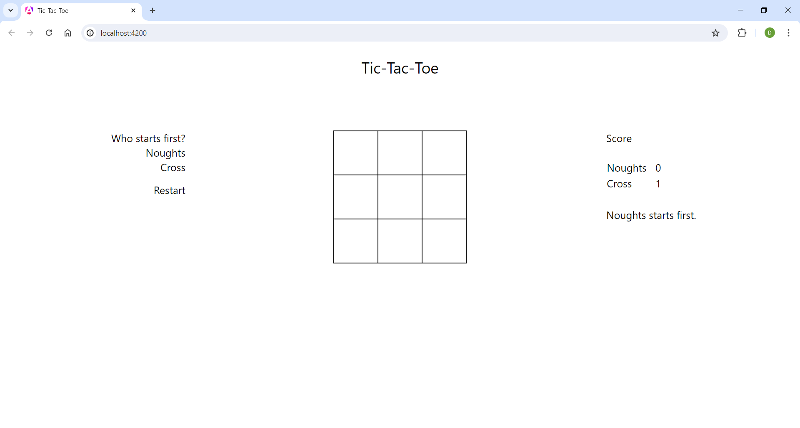
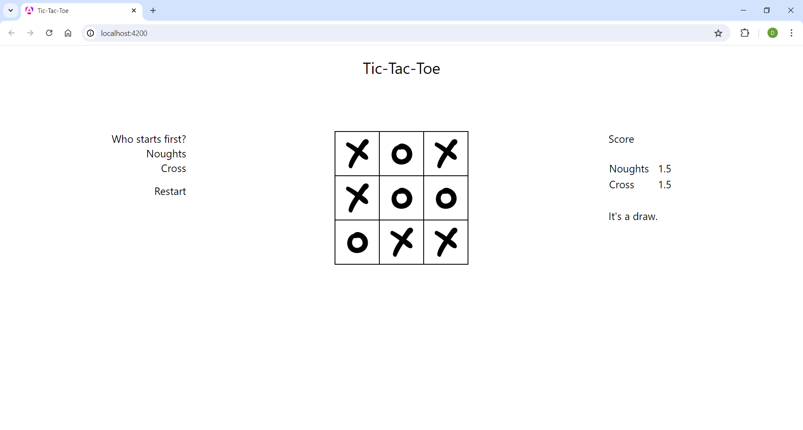
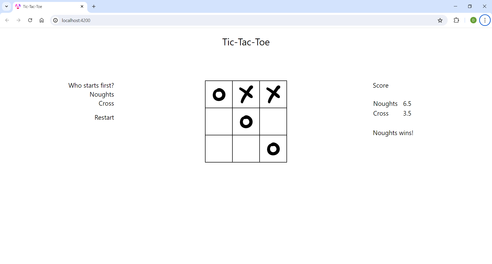

## Tic-Tac-Toe

A game of Tic-Tac-Toe implemented in Angular.

### Presentation

| Homepage                                           | Cross starts first                                                 | 
|----------------------------------------------------|--------------------------------------------------------------------|
|  |  |

| Cross wins                                           | Game restarted                                               | 
|------------------------------------------------------|--------------------------------------------------------------|
|  |  |

| Noughts starts first                                                   | Noughts wins                                             | 
|------------------------------------------------------------------------|----------------------------------------------------------|
|  |  |

| Draw                                       | Score                                        | 
|--------------------------------------------|----------------------------------------------|
|  |  |
